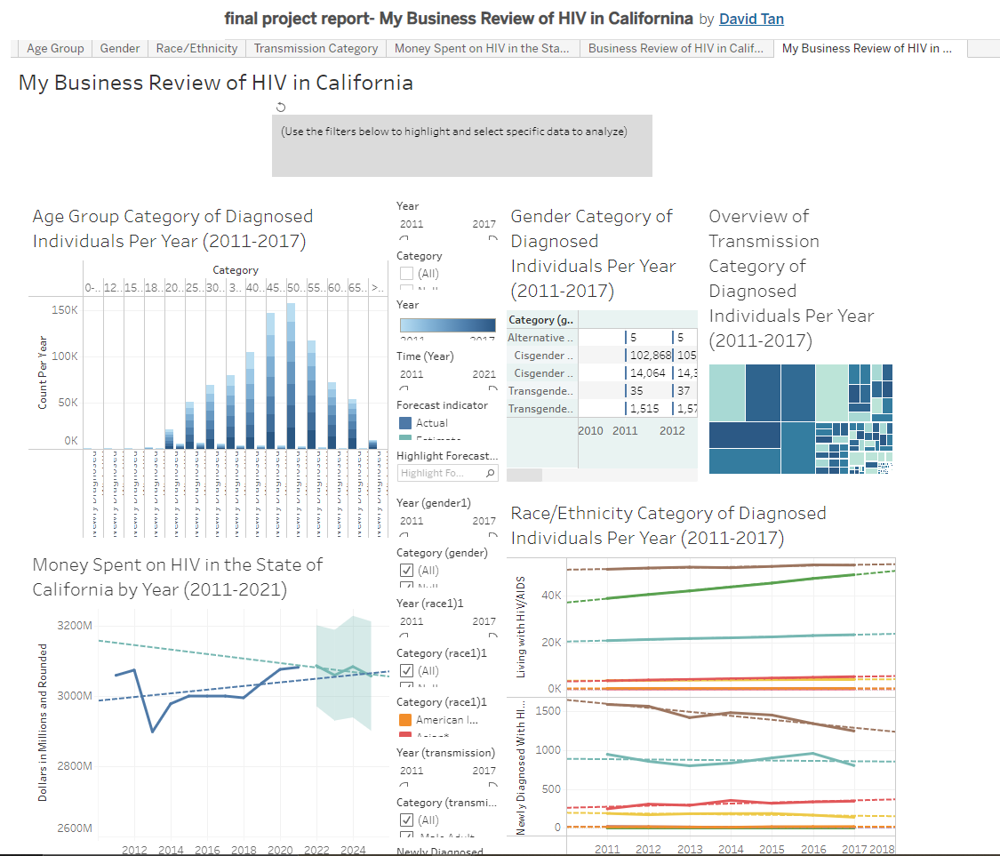

# Title: Tableau Project
### This is "My Business Review of HIV in California" using Tableau

## My Objective: 
### To created a visual dashboard or report in Tableau that examines HIV statistics and trends in the state of California. The dashboard likely includes various data visualizations and charts, such as maps, bar charts, and line charts, to help users understand the data and trends more easily.

My project may include data on various aspects of HIV, such as prevalence rates, transmission routes, demographics of those affected, and access to treatment and prevention resources. I included information on public health initiatives and policies related to HIV in California.

Overall, My project likely serves as a comprehensive and user-friendly resource for anyone interested in learning more about the state of HIV in California, including healthcare professionals, policy-makers, and members of the general public.

## Sceenshot:

## What did I learned:
1. The prevalence rates of HIV in California, including any trends or changes over time.
2. The demographic groups that are most affected by HIV in California, such as age, gender, race, and sexual orientation.
3. The common routes of transmission for HIV in California, including sexual contact, sharing needles, and mother-to-child transmission.
4. The current status of HIV treatment and prevention resources in California, including access to antiretroviral therapy (ART) and pre-exposure prophylaxis (PrEP).
5. The public health policies and initiatives aimed at reducing the spread of HIV in California, such as educational campaigns, condom distribution programs, and needle exchange programs.
6. The challenges and barriers that exist in addressing the HIV epidemic in California, such as stigma, discrimination, and limited resources in certain communities.

## What I would improved:
1. Consider adding additional contextual information or annotations to help users understand the significance of the data you're presenting. For example, I could include information on the social, economic, or political factors that may be contributing to the HIV epidemic in California.
2. Make sure that this project is accessible and user-friendly. Consider testing it with users from different backgrounds and levels of expertise to ensure that it is easy to navigate and understand.
3. Consider including more interactive features or functionality to my dashboard, such as filters or tooltips, to allow users to explore the data in more detail.

## Key feature:
1. A comprehensive analysis of HIV statistics and trends in California, including prevalence rates, transmission routes, demographics, and access to treatment and prevention resources.
2. Visualizations that provide users with a clear and easy-to-understand overview of the data, such as maps, bar charts, and line charts.
3. Interactive features or functionality that allow users to explore the data in more detail, such as filters, tooltips, or drill-down functionality.

## Link to your Tableau Public Profile for project:

https://public.tableau.com/views/finalprojectreport-MyBusinessReviewofHIVinCalifornina/MyBusinessReviewofHIVinCalifornia?:language=en-US&:display_count=n&:origin=viz_share_link

